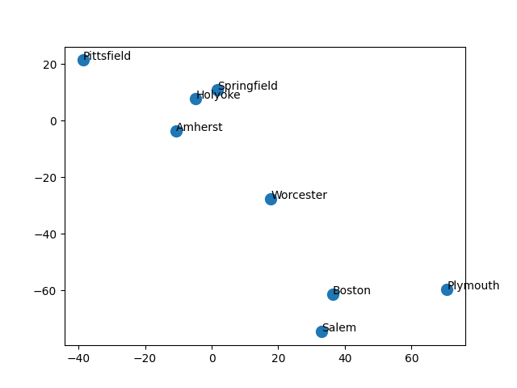
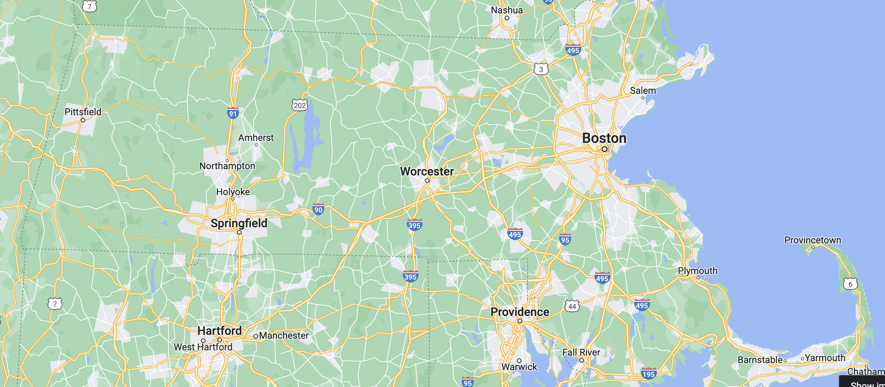
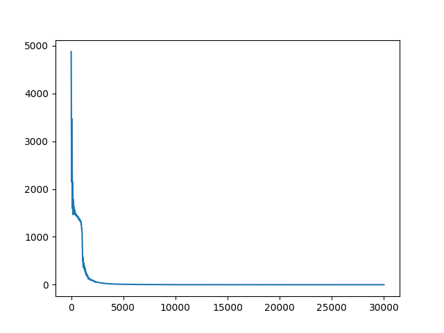
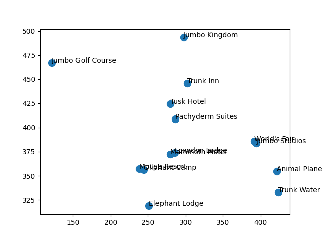
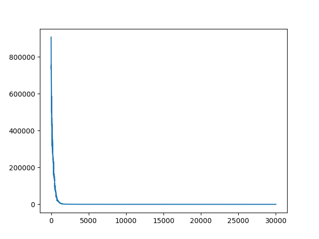

# distance-optimization #
Given a list of points and target distances between them, this algorithm uses gradient descent to find an optimal configuration of points in N-dimensional space. This can be used by urban planners for optimizing building placement or roboticists for GPS-like global positioning from one stationary node.

Mostly this is just a fun project to learn more about optimization techniques and applications of gradient descent.

## Methods ##
### Loss ###
MSE Loss was calculated with respect to x and y using the following derivation:
```
E = (D - t) ^ 2
dE/dx = 2(D - t) * (dD/dx)

D = ((y2 - y1)^2 + (x2 - yx1)^2) ^ (1/2)
dD/dx = (1/d)(x2 - x1)

dE/dx = 2 * ((D - t) / D) * (x2 - x1)
```

### Optimizer ###
SGD was implemented with momentum. One step is as follows:
```
point.position -= gradient * self._learning_rate + self._momentum * self._prev_change
```

### Simulated Annealing ###
At each optimization step, the next point to optimize is randomly chosen from the set of all points weighted towards points with larger error. This weighting factor is determined by a "temperature" parameter. Temperature begins at a high value (all points have near equal probabilities of being chosen) and decreases with each optimization step (points with high error are more likely to be chosen).

This method borrows ideas from [simulated annealing](https://en.wikipedia.org/wiki/Simulated_annealing) which aims to mimic how molecules in a cooling metal first create optimal global structures and then local structures as temperature decreases.

## Benchmarks ##
Benchmarks can be run with `python3 generate_benchmarks.py num_nodes` with the same arguments as `main.py`. This script generates `num_nodes`-many random points and calculates distances between then. These true distances are then used as inputs to the algorithm. This can be used to run generalized experiments.

## Results ##
### Massachusetts Cities/Towns ###
I collected distance information about cities and towns in Massachusetts from Google Maps. I assume that the Earth is flat for this local area (triangles add up to 180º). I was able to achieve a loss of 0.0287 after 30000 steps.

Local positions



Ground truth



Loss



``` python
points = [
    Point([None, 38.73, 13.95, 80.31, 80.41, 74.41, 112.11, 34.54], name="Boston"),
    Point([38.73, None, 49.44, 41.51, 41.93, 37.44, 74.77, 61.90], name="Worcester"),
    Point([13.95, 49.44, None, 91.10, 90.52, 83.36, 120.07, 40.59], name="Salem"),
    Point([80.31, 41.51, 91.10, None, 7.36, 19.00, 41.26, 98.83], name="Springfield"),
    Point([80.41, 41.93, 90.52, 7.36, None, 12.84, 36.35, 101.19], name="Holyoke"),
    Point([74.41, 37.44, 83.36, 19.00, 12.84, None, 37.66, 98.82], name="Amherst"),
    Point([112.11, 74.77, 120.07, 41.26, 36.35, 37.66, None, 135.83], name="Pittsfield"),
    Point([34.54, 61.90, 40.59, 98.83, 101.19, 98.82, 135.83, None], name="Plymouth"),
]

validate_points(points)

animator = Animator(points, 500) if args.animate else None
callback = Callback(animator=animator, verbose=args.verbose)

optimize_kwargs = vars(args)
optimize_kwargs.update({"callback": callback})
optimize_thread = threading.Thread(
    target=optimize_points,
    args=(points, ),
    kwargs=optimize_kwargs
)

optimize_thread.start()
if animator:
    animator.show_animation()
optimize_thread.join()

plot_points(points)
plot_loss(callback.losses)
```

| Parameter | value |
|-|-|
| minimum_loss | 0.0 |
| max_steps | 30000 |
| learning_rate | 0.01 |
| momentum | 0.99 |
| initial_temperature | 500.0 |
| change_temperature | -0.03 |

### Tufts Amusement Parks ###
This is a sample dataset from Tufts' Network Science class. It takes about ~7 runs to find a loss <= 130.

Local positions



Loss



``` python
args = parser.parse_args()

points = [  # TODO: ingest graph format
    Point([None] * 6 + _negate_values([136, 74, 30, 156, 72, 109, 42, 57]), name="Jumbo Kingdom"),
    Point([None] * 6 + _negate_values([75, 88, 22, 70, 106, 118, 42, 62]), name="World's Fair"),
    Point([None] * 6 + _negate_values([67, 103, 30, 83, 109, 78, 48, 43]), name="Jumbo Studios"),
    Point([None] * 6 + _negate_values([48, 44, 35, 70, 42, 52, 25, 18]), name="Animal Planet Zoo"),
    Point([None] * 6 + _negate_values([32, 44, 47, 43, 48, 23, 19, 16]), name="Trunk Water Park"),
    Point([None] * 6 + _negate_values([27, 17, 3, 17, 15, 18, 56, 32]), name="Jumbo Golf Course"),

    Point(_negate_values([136, 75, 67, 48, 32, 27]) + [None] * 8, name="Tusk Hotel"),
    Point(_negate_values([74, 88, 103, 44, 44, 17]) + [None] * 8, name="Mammoth Motel"),
    Point(_negate_values([30, 22, 30, 35, 47, 3]) + [None] * 8, name="Elephant Lodge"),
    Point(_negate_values([156, 70, 83, 70, 43, 17]) + [None] * 8, name="Trunk Inn"),
    Point(_negate_values([72, 106, 109, 42, 48, 15]) + [None] * 8, name="Loxodon Lodge"),
    Point(_negate_values([109, 118, 78, 52, 23, 18]) + [None] * 8, name="Pachyderm Suites"),
    Point(_negate_values([42, 42, 48, 25, 19, 56]) + [None] * 8, name="Mouse Resort"),
    Point(_negate_values([57, 62, 43, 18, 16, 32]) + [None] * 8, name="Oliphant Camp"),
]

validate_points(points)

animator = Animator(points, 500) if args.animate else None
callback = Callback(animator=animator, verbose=args.verbose)

optimize_kwargs = vars(args)
optimize_kwargs.update({"callback": callback})
optimize_thread = threading.Thread(
    target=optimize_points,
    args=(points, ),
    kwargs=optimize_kwargs
)

optimize_thread.start()
if animator:
    animator.show_animation()
optimize_thread.join()

plot_points(points)
plot_loss(callback.losses)
```

| Parameter | value |
|-|-|
| minimum_loss | 0.0 |
| max_steps | 30000 |
| learning_rate | 0.03 |
| momentum | 0.99 |
| initial_temperature | 500.0 |
| change_temperature | -0.007 |
