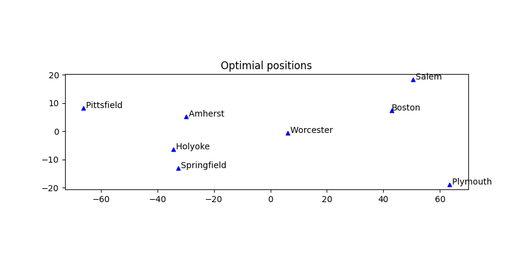

# Distance Optimization #
Given a list of points and target distances between them, this algorithm uses gradient descent to find an optimal configuration of points in N-dimensional space. This can be used by urban planners for optimizing building placement or roboticists for approximate localization.

# Convex Optimization #
This problem can be uniquely solved as a convex problem with margin for error (see [convex_optimization](./convex_optimization/)).

# Gradient Descent #
This problem is also an interesting exercise in gradient descent (see [gradient_descent](./gradient_descent/)).

