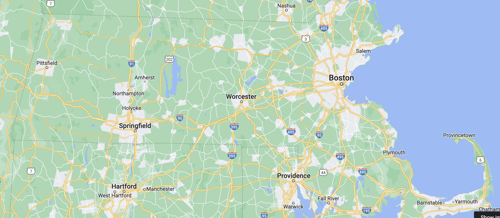

# Convex Optimization #
These methods were learned in Abiy Tassisa's Math 190: Non-linear Optimization. This method uses gram matrix decomposition to solve for the matrix `P` which is constrained by the distanced squared matrix `D`.

# Massachusetts Results #

Solution with margin=0.05

Ground truth

# Tufts Amusement Parks Results #
Given that this is a made-up dataset, it's not surprising that a feasible solution only exists with an extremely high margin of error

Solution with margin=0.78

